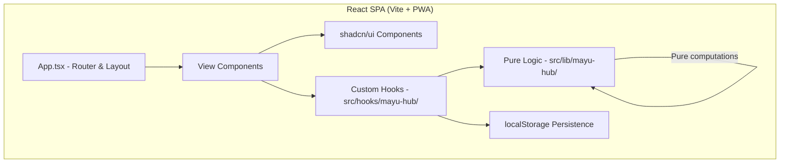
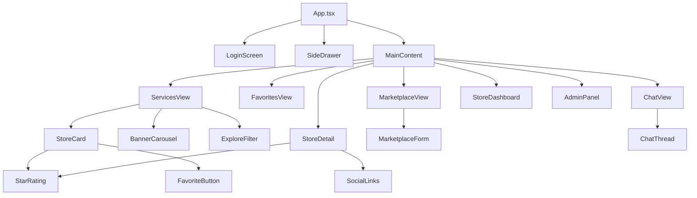
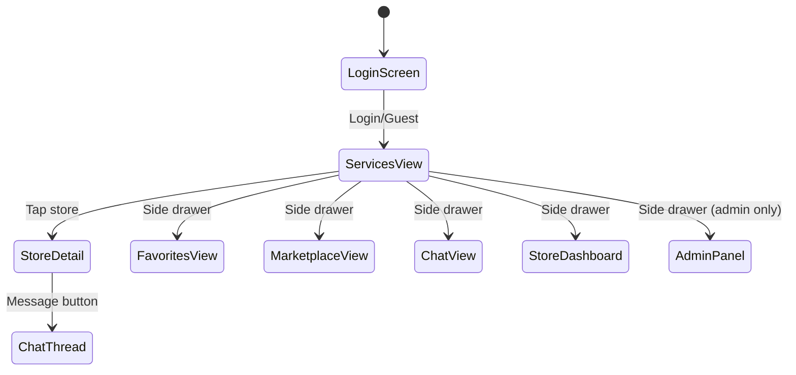

# Design Document: Mayu Hub Upgrade

## Overview

This design covers the comprehensive upgrade of Mayu Hub — a neighborhood services directory PWA for 15 May City, Egypt. The upgrade introduces phone/OTP login, explore filters, banner carousel, star ratings, favorites, a buy-and-sell marketplace, in-app messaging, store owner dashboard, side navigation drawer, social media links, and an enhanced admin panel — all powered by localStorage for data persistence and the real 30-store dataset.

**Key Technical Decisions:**

| Decision | Rationale |
|----------|-----------|
| React 19 + Vite 8 + TypeScript 6 + Tailwind CSS 4 | Already configured in the project |
| localStorage for all new data (ratings, favorites, messages, marketplace) | No backend needed; offline-first PWA; simple persistence |
| embla-carousel-react for banner carousel | Already installed; lightweight, touch-friendly |
| shadcn/ui Sheet for side drawer | Already available; accessible, animated |
| Custom hooks for state management (useState/useEffect) | Lightweight; no extra dependencies needed |
| real-data.ts as primary data source | Replaces demo-data.ts; 30 real stores for 15 May City |
| RTL Arabic-first interface | Target audience is Arabic-speaking residents |
| Mobile-first PWA | Primary usage on mobile devices |

## Architecture



### Component Architecture



### Navigation Flow



## Components and Interfaces

### New Components

```typescript
// src/components/mayu-hub/LoginScreen.tsx
interface LoginScreenProps {
  onComplete: (user: UserProfile) => void;
}

// src/components/mayu-hub/SideDrawer.tsx
interface SideDrawerProps {
  isOpen: boolean;
  onClose: () => void;
  currentUser: UserProfile;
  onNavigate: (view: View) => void;
  onLogout: () => void;
}

// src/components/mayu-hub/ExploreFilter.tsx
interface ExploreFilterProps {
  selectedNeighborhood: string | null;
  selectedCategory: string | null;
  deliveryOnly: boolean;
  onNeighborhoodChange: (id: string | null) => void;
  onCategoryChange: (id: string | null) => void;
  onDeliveryToggle: (value: boolean) => void;
  onClear: () => void;
}

// src/components/mayu-hub/StarRating.tsx
interface StarRatingProps {
  storeId: string;
  readonly?: boolean;       // display-only mode for cards
  size?: 'sm' | 'md';
}

// src/components/mayu-hub/FavoriteButton.tsx
interface FavoriteButtonProps {
  storeId: string;
  showCount?: boolean;
}

// src/components/mayu-hub/MarketplaceView.tsx
interface MarketplaceViewProps {
  onBack: () => void;
}

// src/components/mayu-hub/MarketplaceForm.tsx
interface MarketplaceFormProps {
  onSubmit: (ad: ClassifiedAdInput) => void;
  onCancel: () => void;
}

// src/components/mayu-hub/ChatView.tsx
interface ChatViewProps {
  onBack: () => void;
  onOpenThread: (threadId: string) => void;
}

// src/components/mayu-hub/ChatThread.tsx
interface ChatThreadProps {
  storeId: string;
  storeName: string;
  onBack: () => void;
}

// src/components/mayu-hub/StoreDashboard.tsx
interface StoreDashboardProps {
  onBack: () => void;
}

// src/components/mayu-hub/SocialLinks.tsx
interface SocialLinksProps {
  facebook?: string;
  instagram?: string;
  whatsapp?: string;
}
```

### Modified Components

```typescript
// App.tsx - Add side drawer, new views, remove NeighborhoodModal
type View = 'login' | 'services' | 'store-detail' | 'favorites' |
            'marketplace' | 'messages' | 'chat-thread' | 'my-store' |
            'admin' | 'register-store' | 'profile' | 'community' | 'emergency'

// StoreCard.tsx - Add rating display and heart button
interface StoreCardProps {
  store: StoreProfile;
  status: 'open' | 'closed';
  categoryName?: string;
  neighborhoodName?: string;
  onClick?: () => void;
  // NEW:
  averageRating: number;
  totalRatings: number;
  isFavorited: boolean;
  favoritesCount: number;
}

// StoreDetail.tsx - Add rating input, message button, social links
interface StoreDetailProps {
  store: StoreProfile;
  workingHours: WorkingHours[];
  neighborhoodName: string;
  categoryName?: string;
  deliveryNeighborhoods?: string[];
  onBack: () => void;
  // NEW:
  onMessage: (storeId: string) => void;
}

// ServicesView.tsx - Use real-data, add ExploreFilter, BannerCarousel
// Replace demo-data imports with real-data imports
// Add ExploreFilter dropdown above store listings

// AdminPanel - Add new tabs: users, analytics, banners, marketplace moderation
```

### Custom Hooks

```typescript
// src/hooks/mayu-hub/useRatings.ts
function useRatings(storeId: string): {
  averageRating: number;
  totalRatings: number;
  userRating: number | null;
  submitRating: (rating: number) => void;
}

// src/hooks/mayu-hub/useFavorites.ts
function useFavorites(): {
  favorites: string[];
  isFavorited: (storeId: string) => boolean;
  toggleFavorite: (storeId: string) => void;
  getFavoritesCount: (storeId: string) => number;
}

// src/hooks/mayu-hub/useMarketplace.ts
function useMarketplace(): {
  ads: ClassifiedAd[];
  addAd: (ad: ClassifiedAdInput) => void;
  removeAd: (adId: string) => void;
  filterByCategory: (category: string | null) => ClassifiedAd[];
}

// src/hooks/mayu-hub/useMessaging.ts
function useMessaging(): {
  threads: ChatThread[];
  getThread: (storeId: string) => ChatThread | null;
  sendMessage: (storeId: string, text: string) => void;
  getUnreadCount: () => number;
}

// src/hooks/mayu-hub/useStoreViews.ts
function useStoreViews(storeId: string): {
  viewCount: number;
  incrementView: () => void;
}
```

## Data Models

### New TypeScript Types

```typescript
// Additions to src/lib/mayu-hub/types.ts

// === Ratings ===
interface StoreRatings {
  [storeId: string]: {
    [userId: string]: number; // 1-5
  };
}

// === Favorites ===
interface UserFavorites {
  [userId: string]: string[]; // array of storeId
}

// === Marketplace ===
interface ClassifiedAd {
  id: string;
  userId: string;
  userName: string;
  title: string;
  description: string;
  price: number;
  photoUrl: string | null;  // base64 data URL or null
  phone: string;
  category: MarketplaceCategory;
  createdAt: string;
  isActive: boolean;
}

type MarketplaceCategory =
  | 'electronics' | 'furniture' | 'vehicles' | 'clothing'
  | 'home_appliances' | 'sports' | 'books' | 'other';

interface ClassifiedAdInput {
  title: string;
  description: string;
  price: number;
  photoUrl: string | null;
  phone: string;
  category: MarketplaceCategory;
}

// === Messaging ===
interface ChatMessage {
  id: string;
  threadId: string;
  senderId: string;
  senderName: string;
  text: string;
  timestamp: string;
  isRead: boolean;
}

interface ChatThread {
  id: string;           // format: `${userId}_${storeId}`
  userId: string;
  storeId: string;
  storeName: string;
  lastMessage: string;
  lastMessageAt: string;
  unreadCount: number;
}

// === Store Views ===
interface StoreViews {
  [storeId: string]: number;
}

// === Social Links (extension to StoreProfile) ===
interface StoreSocialLinks {
  facebook?: string;
  instagram?: string;
  whatsapp?: string;
}

// === Guest User ===
interface GuestSession {
  id: string;       // 'guest-{timestamp}'
  isGuest: true;
  createdAt: string;
}
```

### localStorage Keys

| Key | Type | Description |
|-----|------|-------------|
| `mayu_hub_ratings` | `StoreRatings` | All store ratings keyed by storeId then userId |
| `mayu_hub_favorites` | `UserFavorites` | User favorites keyed by userId |
| `mayu_hub_marketplace` | `ClassifiedAd[]` | All marketplace ads |
| `mayu_hub_messages` | `{ [threadId]: ChatMessage[] }` | All chat messages |
| `mayu_hub_threads` | `ChatThread[]` | Chat thread metadata |
| `mayu_hub_store_views` | `StoreViews` | View counts per store |
| `mayu_hub_store_social` | `{ [storeId]: StoreSocialLinks }` | Social links per store |
| `mayu_hub_users` | `UserProfile[]` | Registered users (existing) |
| `mayu_hub_current_user` | `UserProfile` | Current session (existing) |
| `mayu_hub_banners` | `BannerAd[]` | Admin-managed banners (existing) |

### Rating Computation (Pure Function)

```typescript
// src/lib/mayu-hub/ratings.ts
export function computeAverageRating(ratings: Record<string, number>): {
  average: number;  // rounded to 1 decimal
  total: number;
} {
  const values = Object.values(ratings);
  if (values.length === 0) return { average: 0, total: 0 };
  const sum = values.reduce((a, b) => a + b, 0);
  return {
    average: Math.round((sum / values.length) * 10) / 10,
    total: values.length,
  };
}
```

### Filter Logic (Pure Function)

```typescript
// src/lib/mayu-hub/explore-filter.ts
export function applyExploreFilters(
  stores: StoreProfile[],
  filters: {
    neighborhoodId: string | null;
    categoryId: string | null;
    deliveryOnly: boolean;
  }
): StoreProfile[] {
  return stores.filter(store => {
    if (filters.neighborhoodId && store.neighborhoodId !== filters.neighborhoodId) return false;
    if (filters.categoryId && store.categoryId !== filters.categoryId) return false;
    if (filters.deliveryOnly && !store.delivers) return false;
    return true;
  });
}
```

### Marketplace Validation (Pure Function)

```typescript
// src/lib/mayu-hub/marketplace.ts
export function validateClassifiedAd(input: ClassifiedAdInput): ValidationResult {
  const errors: Record<string, string> = {};
  if (!input.title || input.title.trim().length === 0) {
    errors.title = 'العنوان مطلوب';
  }
  if (!input.price || input.price <= 0) {
    errors.price = 'السعر مطلوب ويجب أن يكون أكبر من صفر';
  }
  if (!input.phone || input.phone.trim().length === 0) {
    errors.phone = 'رقم الهاتف مطلوب';
  }
  return { valid: Object.keys(errors).length === 0, errors };
}
```


## Correctness Properties

*A property is a characteristic or behavior that should hold true across all valid executions of a system — essentially, a formal statement about what the system should do. Properties serve as the bridge between human-readable specifications and machine-verifiable correctness guarantees.*

### Property 1: Guest mode restricts all write operations

*For any* write operation (rating, favoriting, messaging, posting ads) attempted by a guest user, the system SHALL block the operation and return a login prompt indicator, leaving the underlying data unchanged.

**Validates: Requirements 1.6**

### Property 2: Explore filters use AND logic

*For any* set of stores and *for any* combination of active filters (neighborhood, category, delivery), every store in the filtered results SHALL satisfy all active filter criteria simultaneously, and no store satisfying all active criteria SHALL be excluded from the results.

**Validates: Requirements 3.3, 3.4, 3.5, 3.6**

### Property 3: Rating average computation

*For any* non-empty set of integer ratings (each between 1 and 5), the computed average SHALL equal the arithmetic mean rounded to one decimal place. For an empty set of ratings, the average SHALL be 0.

**Validates: Requirements 5.3, 5.5**

### Property 4: Favorite toggle is its own inverse

*For any* user and *for any* store, toggling the favorite state twice SHALL return the favorites list to its original state (adding then removing, or removing then adding).

**Validates: Requirements 6.2**

### Property 5: Favorites view shows exactly favorited stores

*For any* user with a set of favorited store IDs, the favorites view SHALL display exactly those stores and no others.

**Validates: Requirements 6.5**

### Property 6: Favorites persistence round-trip

*For any* user ID and *for any* set of store IDs marked as favorites, persisting to localStorage and reading back SHALL produce an equivalent set.

**Validates: Requirements 6.6**

### Property 7: Marketplace ad persistence round-trip

*For any* valid ClassifiedAd, adding it to the marketplace and reading back the marketplace list SHALL contain an equivalent ad entry.

**Validates: Requirements 7.3, 7.5**

### Property 8: Marketplace category filter

*For any* marketplace category and *for any* set of classified ads, filtering by that category SHALL return only ads with a matching category, and no matching ad SHALL be excluded.

**Validates: Requirements 7.4**

### Property 9: Marketplace validation rejects invalid ads

*For any* ClassifiedAdInput where the title is empty/whitespace-only OR the price is zero/negative, the validation function SHALL return invalid with appropriate error keys. *For any* ClassifiedAdInput with a non-empty title AND positive price AND non-empty phone, validation SHALL return valid.

**Validates: Requirements 7.7**

### Property 10: Messages displayed in chronological order

*For any* set of chat messages in a thread with distinct timestamps, the displayed order SHALL be sorted ascending by timestamp (oldest first).

**Validates: Requirements 8.3**

### Property 11: Message persistence round-trip

*For any* chat thread and *for any* sequence of messages sent to that thread, persisting to localStorage and reading back SHALL produce the same messages in the same order.

**Validates: Requirements 8.5**

## Error Handling

### Client-Side Errors

| Scenario | Handling |
|----------|----------|
| Guest user attempts write operation | Show toast "سجل دخول أولاً" with login button; block the operation |
| Invalid phone number format on login | Inline field error "رقم هاتف غير صالح" |
| OTP verification fails 3 times | Show error + "إعادة إرسال" button; reset attempt counter |
| Marketplace form missing required fields | Inline field errors; prevent submission |
| localStorage quota exceeded | Show toast "المساحة ممتلئة"; suggest clearing old messages |
| Image too large for base64 storage | Client-side resize before storing; max 500KB |
| Rating submission for non-existent store | Silently ignore; log to console |

### Edge Cases

| Case | Behavior |
|------|----------|
| Store with no ratings | Display "لا تقييمات" with empty stars |
| User favorites empty | Show empty state "لم تضف مفضلات بعد" |
| Marketplace with no ads | Show empty state "لا توجد إعلانات" with add button |
| Chat thread with no messages | Show empty state with input field ready |
| Banner carousel with 0 banners | Hide carousel section entirely |
| Banner carousel with 1 banner | Show static banner, no rotation |
| Store owner with no views | Display "0 مشاهدات" |
| localStorage corrupted/cleared | Gracefully reset to defaults; user re-logs in |

## Testing Strategy

### Property-Based Tests (fast-check)

The project already has `fast-check` v4.8.0 configured with Vitest. Property tests run via `npm run test:property` with 200 iterations.

**Test Files:**
- `tests/properties/mayu-hub/explore-filter.property.test.ts` — Property 2
- `tests/properties/mayu-hub/ratings.property.test.ts` — Property 3
- `tests/properties/mayu-hub/favorites.property.test.ts` — Properties 4, 5, 6
- `tests/properties/mayu-hub/marketplace.property.test.ts` — Properties 7, 8, 9
- `tests/properties/mayu-hub/messaging.property.test.ts` — Properties 10, 11
- `tests/properties/mayu-hub/guest-mode.property.test.ts` — Property 1

**Tag format:** `// Feature: mayu-hub, Property {N}: {title}`

Each property test:
- Runs minimum 100 iterations (configured at 200 via env var)
- References its design document property in a comment tag
- Uses `fc.assert` with `fc.property` for universal quantification

### Unit Tests (Example-Based)

Example-based tests for specific scenarios and UI interactions:
- Login flow (phone entry → OTP → success/failure)
- Guest mode creation and session handling
- Banner carousel rendering and auto-rotation
- Side drawer open/close behavior
- Store detail page rendering with all data combinations
- Admin panel tab navigation and actions

### Integration Tests

- Full flow: Login → Browse → Rate → Favorite → View favorites
- Marketplace: Post ad → Filter → View
- Messaging: Open thread → Send message → View in thread list
- Admin: Approve store → Verify visible in directory
